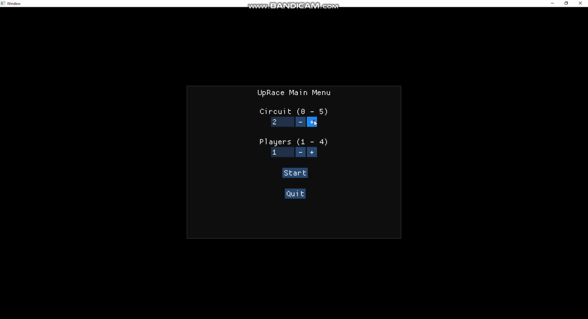

# UpRace!
Top-Down game project. I ended this project today (07/23/2026) 30 days later the start. I think this is a good game.
I couldn't create the AI that I thought but the basics is there, the sound was a challenge for me, actually I didn't add it.
Maybe in the future I come back again to add sound, I hope you like this project; for me, this was the most important and 
cool to made. I am proud of it.

## About The Project
This is one of my goals to this year to consolidate my knowledge in game logic and OpenGL, and other technologies.
I was thinking (at the beginning) to create AI and multithreading but wasn't necessary (maybe the AI, but I am not 
able to create it without copying, so in the future I can add it), so I put it out. Now this projects handles 
five circuits and four possible players (without AI). Is a simple race game. One of my projects to consolidate and 
increase my portfolio.

## How to play
We have five circuits and four players, you will select the circuit in the main menu and then
select how many players you will want to use. To play with then you will use:
- W / Up / Num. 8 / I -> throttle;
- S / Down / Num. 5 / K -> break;
- A / Left / Num. 4 / J -> turn left;
- D / Right / Num. 6 / L -> turn right,

Being:
- Player 1 - WASD
- Player 2 - Arrows
- Player 3 - Numeric Keyboard
- Player 4 - IJKL

The Lap System is not perfect, but I think this works.

## How Compile
I didn't finalized the compile command yet, but you can compile with:
- GNU Make
- GNU GCC (at least with C++26, you can use the w64devkit to it)
- CMake (in the future)
Just using `make` to compile (make sure to have all requirements). The CMake is a third party
study, so I am learning it as I'm studying the main goal.

## Contact
If you wanna to send a message to me, give me feedback or just talk (considering I'm terrible to socialize and maintain 
contact) you can send an email to me in eriksander5252principal@hotmail.com. I hope you like my portfolio!
